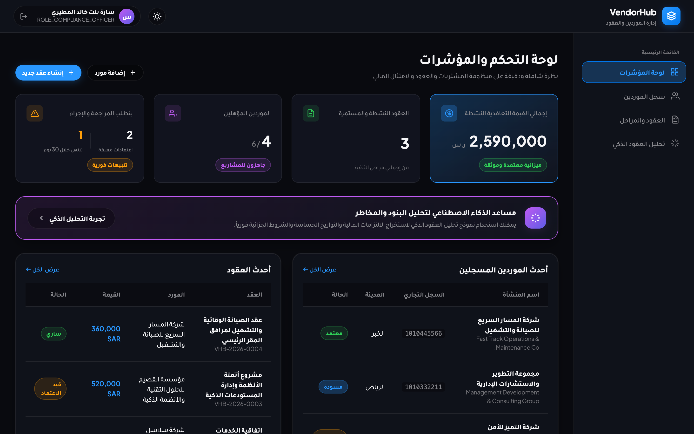
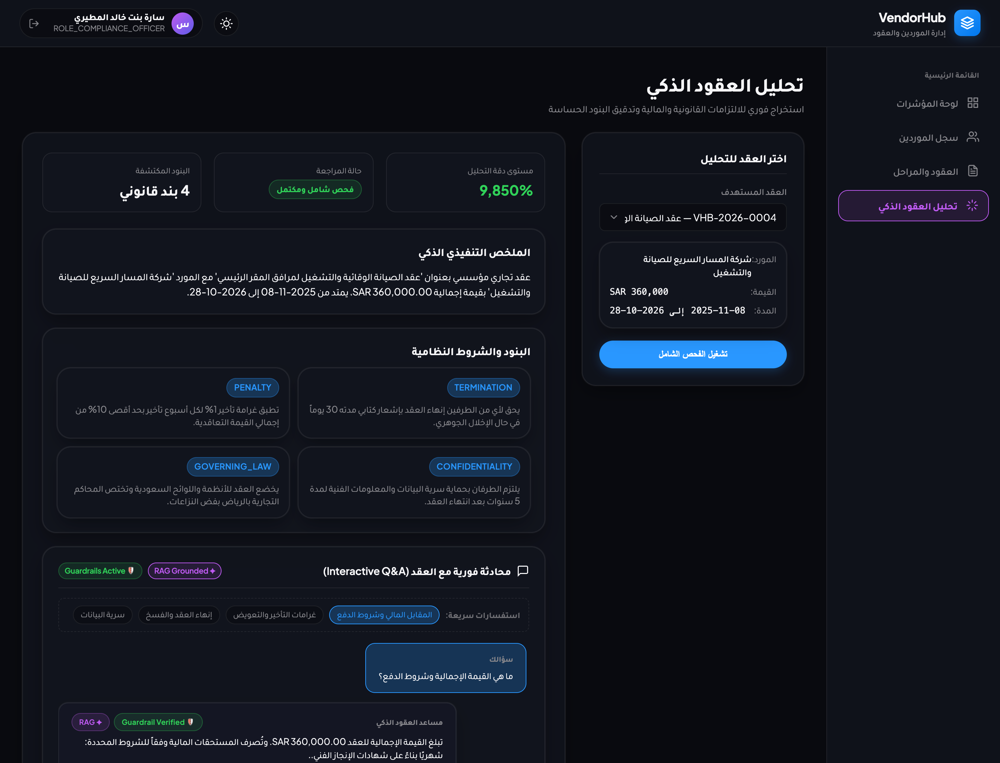
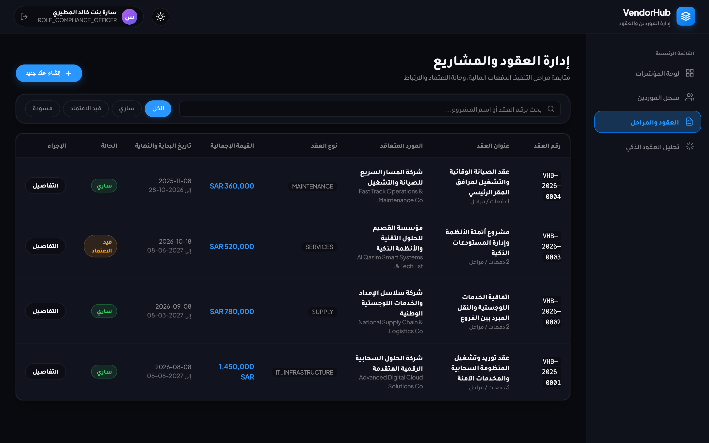
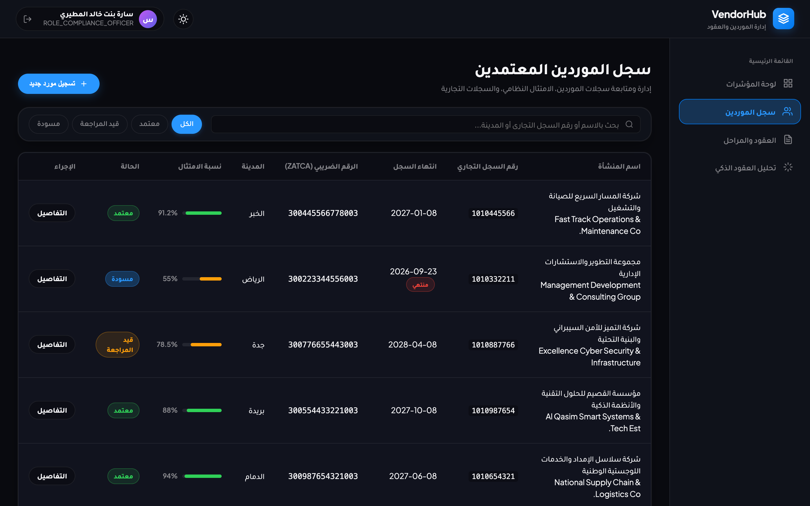
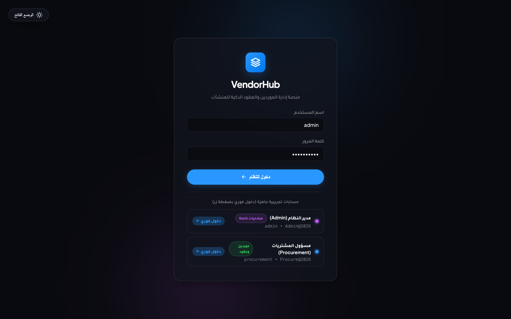

# VendorHub: Enterprise Vendor and Contract Management Platform

[](https://openjdk.org/)
[](https://spring.io/projects/spring-boot)
[](https://angular.dev/)
[](https://www.postgresql.org/)
[](https://www.docker.com/)
[]()

VendorHub is an enterprise platform designed for managing vendor lifecycles, commercial contract workflows, deliverable milestones, and AI-driven contract intelligence. Built with Spring Boot 3 (Java 21), Angular, and PostgreSQL, with regional compliance support for Saudi commercial regulations including Commercial Registration (CR) and ZATCA VAT standards.

## User Interface

### Executive Dashboard


### Interactive Contract Q&A and AI Assistant (RAG and Guardrails)


### Contracts Lifecycle and Milestone Management


### Approved Vendors and Regional Compliance Tracking


### Authentication and Access Portal


## System Architecture

```text
                    Angular Frontend (SPA)
                           |
                           | HTTPS / REST (JWT)
                           v
                 Spring Boot 3 Backend Server
                           |
        +------------------+------------------+
        |                  |                  |
        v                  v                  v
   PostgreSQL       Spring Security       AI Service (FastAPI)
    Database            + JWT                 |
                                              v
                                      RAG / Guardrails / LLM
```

* Core Business Backend: Implemented with Spring Boot 3 utilizing layered architecture (Controllers, Services, Repositories, Entities, and DTOs).
* Decoupled AI Microservice: Isolated Python/FastAPI service for contract chunking, RAG semantic retrieval, prompt guardrails, and OpenAI GPT-4o-mini integration.
* Modern Frontend: Angular application with Standalone Components, Signal-based state management, route guards, and HTTP interceptors.

## Key Features

### 1. Role-Based Access Control (RBAC) and Security
* Stateless Signed JWT (HMAC-SHA384 / JWS) authentication with BCrypt password hashing.
* Distinct personas: ROLE_ADMIN, ROLE_PROCUREMENT_OFFICER, ROLE_COMPLIANCE_OFFICER, and ROLE_VENDOR_REPRESENTATIVE.
* Automatic auditing (@CreatedBy, @CreatedDate, @LastModifiedDate) across all records.

### 2. Vendor Management and Compliance
* Comprehensive vendor onboarding with bilingual support (Arabic and English).
* Validation of Saudi Commercial Registrations (10 digits) and ZATCA VAT IDs (15 digits).
* Automated expiry tracking for commercial registrations.
* Server-side pagination, multi-field filtering, and sorting optimized with JPA EntityGraph.
* Optimistic locking (@Version) to prevent concurrent update conflicts.

### 3. Contract Lifecycle and Deliverable Milestones
* Complete contract lifecycle states: DRAFT, PENDING_APPROVAL, ACTIVE, COMPLETED, TERMINATED.
* Strict date consistency validation (endDate >= startDate).
* Financial tracking with breakdown into deliverable milestones.
* Real-time financial aggregation per vendor in Saudi Riyals (SAR).

### 4. AI Contract Intelligence with RAG and Guardrails
* Contract Chunking and Semantic Retrieval (RAG): Automatic decomposition of contracts into legal articles (Parties, Duration, Financial Terms, Penalties, Termination, Confidentiality, Governing Law).
* Input Guardrails: Prompt injection and jailbreak defense, PII masking (National ID, Credit Cards, IBAN), and out-of-scope domain filtering.
* Output Guardrails: Grounding verification and anti-hallucination scoring with explicit clause citations.
* OpenAI GPT-4o-mini Integration: Cloud LLM inference with automated fallback to the local deterministic RAG generator.

## Project Structure

```text
vendorhub/
├── backend/              # Spring Boot 3 and Java 21 REST API
├── frontend/             # Angular 18+ Client Application
├── ai-service/           # FastAPI Contract Intelligence Microservice
├── docs/                 # Requirements, ERD, and API Specifications
│   ├── screenshots/      # Application user interface screenshots
│   ├── requirements.md
│   ├── api-specification.md
│   └── architecture.md
├── docker-compose.yml    # Container orchestration
└── README.md
```

## Getting Started

### Prerequisites
* Java 21 LTS
* Apache Maven 3.9+
* Node.js 20+ and npm
* Python 3.9+
* Docker and Docker Compose (optional)

### Running Backend Tests
```bash
cd backend
mvn clean test
```

### Running with Docker Compose
```bash
docker compose up --build -d
```

### Access Points
* Frontend Client: http://localhost:4200
* Backend REST API: http://localhost:8080/api/v1
* Swagger API Docs: http://localhost:8080/swagger-ui.html
* AI Microservice Docs: http://localhost:8000/docs

## Testing and Verification
The backend includes a comprehensive suite of unit and integration tests using JUnit 5, Mockito, and AssertJ:
* VendorEntityTest: Validates CR and VAT formats, optimistic locking, and expired record queries.
* ContractEntityTest: Tests milestone cascading, chronological integrity, and financial aggregations.
* DocumentAndAuditTest: Verifies SHA-256 document hashing, AI result tracking, and audit logging.
* UserRoleSecurityTest: Tests multi-role assignments and unique constraints.
