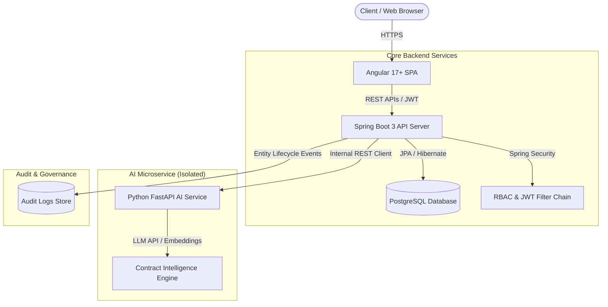

# 🏗️ VendorHub — Enterprise Architecture & Design

---

### 1. High-Level System Architecture



---

### 2. Monorepo Structure

```text
vendorhub/
│
├── frontend/             # Angular 17+ Single Page Application
│   ├── src/
│   │   ├── app/
│   │   │   ├── core/     # Interceptors, Guards, Auth Service
│   │   │   ├── shared/   # Reusable UI components, Pipes, Models
│   │   │   └── modules/  # Auth, Vendors, Contracts, Dashboard, AI Assistant
│   └── package.json
│
├── backend/              # Spring Boot 3 & Java 21 Enterprise Server
│   ├── pom.xml
│   └── src/
│       ├── main/java/com/vendorhub/
│       │   ├── common/   # AuditableBaseEntity, GlobalExceptionHandler
│       │   ├── config/   # SecurityConfig, JpaAuditingConfig
│       │   ├── user/     # User, Role, RBAC
│       │   ├── vendor/   # Vendor entity, Repository, Service, Controller
│       │   ├── contract/ # Contract, Milestones, Services, Controller
│       │   ├── document/ # Document storage & audits
│       │   ├── ai/       # AI Client, DTOs, fallback handling
│       │   └── audit/    # System audit trail logs
│       └── test/java/com/vendorhub/
│           └── ... (12+ Unit & Integration Tests)
│
├── ai-service/           # Lightweight Python / FastAPI Contract Assistant
│   ├── app/
│   │   ├── main.py
│   │   └── contract_analyzer.py
│   ├── requirements.txt
│   └── Dockerfile
│
├── docs/                 # Engineering Documentation
│   ├── requirements.md
│   ├── api-specification.md
│   └── architecture.md
│
├── docker-compose.yml    # Single command orchestration
└── README.md             # Project portfolio presentation
```

---

### 3. Engineering Decisions & Rationale (Interview Talking Points)

| Decision | Selected Approach | Rationale & Trade-offs |
|---|---|---|
| **Architectural Style** | Modular Monolith with Isolated AI Microservice | Keeps the core system simple and easy to deploy, while keeping AI decoupled so LLM latency or failures never crash core business CRUD. |
| **Data Integrity** | DTOs + Strict Bean Validation + DB Constraints | Avoids exposing entity structure. Validates CR (10 digits) and VAT (15 digits) at both application and DB levels. |
| **Concurrency Control** | Optimistic Locking (`@Version`) | Prevents dirty writes and race conditions during concurrent vendor status updates. |
| **State Management in Frontend** | RxJS BehaviorSubjects + Angular Signals | Avoids unnecessary NgRx boilerplate; lightweight, idiomatic, and highly readable. |
| **Security Model** | Signed JWT (JWS HMAC-SHA256) + Spring Security RBAC | Uses cryptographically signed tokens (`verifyWith(key)`) for integrity and authenticity without exposing sensitive data; access enforced at method level via `@PreAuthorize`. |
| **Search & Query Performance** | Spring Data JPA + `@EntityGraph` (B-Tree & Trigram Strategy) | `@EntityGraph` completely eliminates N+1 queries. B-Tree indexes handle exact lookups, foreign keys, and status filters, while wildcard search (`%search%`) in production is designed for PostgreSQL `pg_trgm` GIN indexing. |
| **Resilience & Fallback** | Isolated FastAPI Service + Graceful Local Fallback | Decouples AI contract analysis so that AI microservice downtime triggers a deterministic fallback with explicit logging and status flags (`processedByAiMicroservice: false`). |
| **Testing Suite** | 22 Deep Unit & Integration Tests | Verifies unique constraints, optimistic locking collisions, cascading lifecycles, and Spring Security authentication. |

